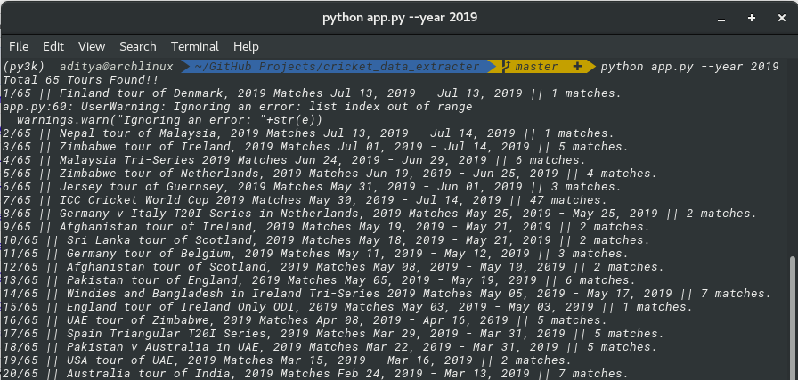

# cricker_data_extracter
A set of python scripts to extract cricket data from https://cricbuzz.com.

## Getting Started
Here I will explain how to run the script to extract data.

### Prerequisites
You will need Python 3.X.X with some packages which you can install direclty using requirements.txt.
> pip install -r requirements.txt

### Extracting the data
1. Use app.py to run the app which requires following flags '--year' Year for data, '--dir' Directory where to save all data
>  python app.py --year 2019 --dir data

## Built Using
1. BeautifulSoup
2. Urllib3
3. Pandas

## Authors
* Aditya Jain : [Portfolio](https://adityajain.me)

## Licence
This project is licensed under the MIT License - see the [LICENSE.md](https://github.com/adityajn105/cricket_data_extracter/blob/master/LICENSE) file for details
